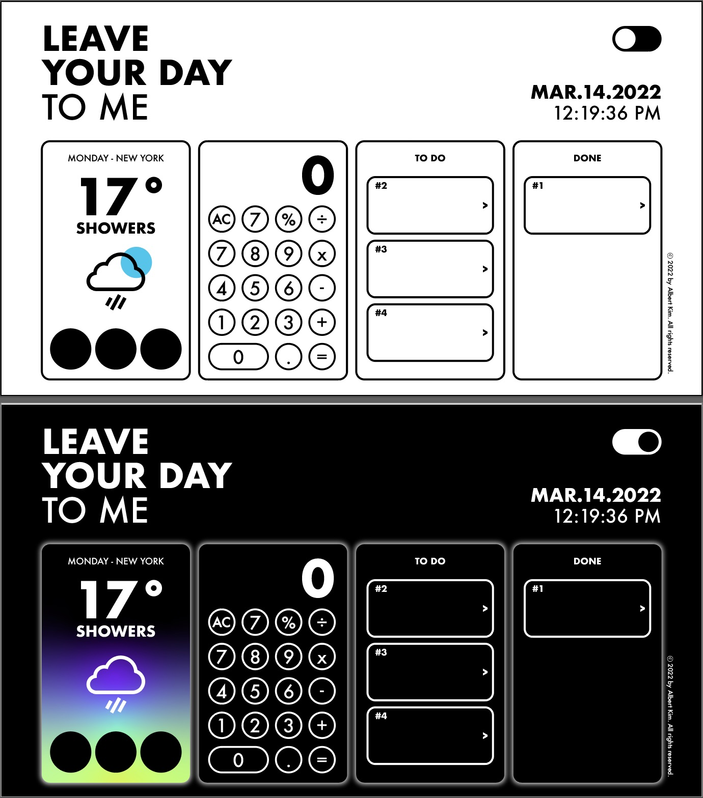

# Dashboard

[Live site link](https://rlachivirus.github.io/Dashboard/)

# Overview
The Dashboard is a mini project that I decided to work on after experiencing some difficulties in solving frontend coding challenges using React Hooks. In order to upgrade my React skills to include Hooks, I decided to work on a personal project that combines 3 basic mini projects: to-do list, weather API, and calculator. I find that working on a project helps me gain practical experience with technology while allowing me to experiment and see results quickly. 

Initially, I was working on this project by myself so I was formatting everything based on the blueprint I created. While working on the project, however, a friend of mine, who is a desginer, wanted to help out with the overall design because she thought the original dashboard looked too plain. I thought this would be a good practice collaborating with someone so I decided to work together and try to render according to her plan.

The following is the layout my friend provided:
